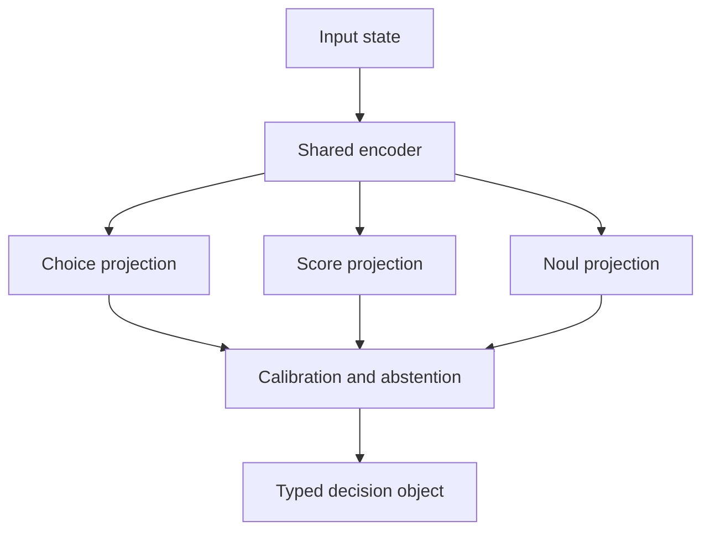

# FastPath AI

**Schema-first, non-generative decision inference for deterministic software paths.**

FastPath AI turns an input state into bounded decisions through one shared encoding pass and
parallel classification or regression heads. It does not generate prose, JSON, or tool calls.
The runtime returns only values permitted by the application contract, plus probabilities,
confidence, variance where applicable, and an abstention signal.

> Status: `v0.1.0-alpha.2`. This is a proof-of-concept runtime with one small, trained reference
> model. It is not the proposed `fastpath-3b-v1`, a transformer model, or a production safety
> control.

## What this release is

This release demonstrates the FastPath programming model: compile a typed decision contract,
encode an input once, evaluate several learned heads in parallel, and return only bounded values.
It includes a reproducible ticket-triage model trained on synthetic data.

| Component | Implemented in `v0.1.0-alpha.2` |
|---|---|
| Encoder | Fixed 512-dimensional signed feature hashing |
| Choice head | Scikit-learn logistic regression |
| Noul head | Scikit-learn logistic regression |
| Score head | Scikit-learn ridge regression |
| Training data | 320 synthetic ticket records |
| Model artifact | 42 KB JSON file containing learned weights |
| Inference | Local NumPy, single encoding pass with parallel head projections |

This release does **not** contain a transformer backbone, a 3B-parameter model, pretrained or
enterprise-ready weights, RLCD, Brier-loss optimization, System 2-to-1 distillation, multimodal
input, or Rust, TypeScript, ONNX, and Edge TPU runtimes. Brier score is available as an evaluation
metric; it is not the training objective used by the included reference trainer.

## Why it exists

Autoregressive large language models are useful when a task needs synthesis or reasoning.
They are often a poor fit for frequent, bounded decisions such as routing, severity scoring,
policy gates, and tool selection. Those paths benefit from typed outputs, measured calibration,
low CPU latency, and an explicit way to abstain.

FastPath is closer to a schema-compiled multi-task classifier than a smaller chat model.

## Quick start

```bash
python -m pip install -e ".[dev,train]"
python -m examples.ticket_triage.generate_data
python -m examples.ticket_triage.train
python -m fastpath evaluate \
  --model examples/ticket_triage/fastpath-ticket-triage-v0.json \
  --schema examples.ticket_triage.schema:InboundTicketTriage \
  --state "Production DB CPU at 99 percent and connections exhausted"
```

Define the contract in ordinary Pydantic code:

```python
from pydantic import BaseModel
from fastpath import Choice, Score, Noul


class InboundTicketTriage(BaseModel):
    category: Choice["Infrastructure", "Billing", "Security", "General"]
    urgency: Score[1, 5]
    requires_tier3_page: Noul
```

Evaluate locally:

```python
from fastpath import FastPathEngine

engine = FastPathEngine(
    "examples/ticket_triage/fastpath-ticket-triage-v0.json",
    abstain_threshold=0.70,
)
decision = engine.evaluate(
    "Production DB CPU spiked to 99%. Connections exhausted in us-east-1.",
    InboundTicketTriage,
)

if not decision.requires_tier3_page.abstained and decision.requires_tier3_page.prob > 0.90:
    trigger_pager(category=decision.category.value, urgency=decision.urgency.value)
```

## Architecture



The included alpha kernel uses signed feature hashing because it is small, deterministic,
auditable, and runnable without model downloads. The stable boundary is the encoder interface.
A later ONNX transformer encoder can replace it without changing decision contracts or routing
code.

## Reference-model results

The included model uses the first 80 percent of the 320 generated records for fitting and the
remaining 64 records for temperature selection and evaluation. Running
`python -m examples.ticket_triage.evaluate` currently reports:

| Measure | Synthetic calibration split |
|---|---:|
| Category accuracy | 1.0000 |
| Category Brier score | 0.0000 |
| Category expected calibration error | 0.0000 |
| Tier-3 page accuracy | 1.0000 |
| Tier-3 page Brier score | 0.0000 |
| Urgency mean absolute error | 0.1456 |

These numbers are a pipeline check, not evidence of production generalization. The examples are
synthetic and intentionally easy, and the evaluation partition is also used to select temperature.
There is no untouched test set or representative enterprise benchmark in this release.

## What is actually guaranteed

- Choice values are members of the declared enumeration.
- Scores are bounded by the declared minimum and maximum.
- Noul outputs contain a boolean decision and a probability in `[0, 1]`.
- A model cannot run against a different contract fingerprint.
- The same artifact, state, and runtime version produce the same decision values.

Calibration, accuracy, latency, fairness, and robustness are measured properties, not type-system
guarantees. They must be validated on data representative of each deployment.

## Evaluation gates

Do not promote a model based on accuracy alone. A release candidate should define and satisfy:

| Gate | Example measure |
|---|---|
| Decision quality | Macro F1, AUROC, MAE by head |
| Calibration | Brier score and expected calibration error |
| Selective risk | Error rate at the chosen coverage after abstention |
| Performance | Warm p50, p95, and p99 on named hardware |
| Stability | Drift by label and input cohort |
| Safety | False-negative ceiling for high-impact classes |

## Repository map

- `src/fastpath`: contracts, compiler, runtime, metrics, trainer, and CLI
- `examples/ticket_triage`: synthetic end-to-end example
- `benchmarks`: reproducible warm latency harness
- `tests`: contract, artifact, runtime, and metric tests
- `docs`: architecture and claims register

## Responsible use

Use FastPath as one control inside a broader system. High-impact outcomes need policy checks,
observability, change control, rollback, human escalation, and monitoring for distribution shift.
Never train on enterprise prompt logs unless the organization has rights to the source data and
teacher outputs.

## License

MIT License. See `LICENSE`.
