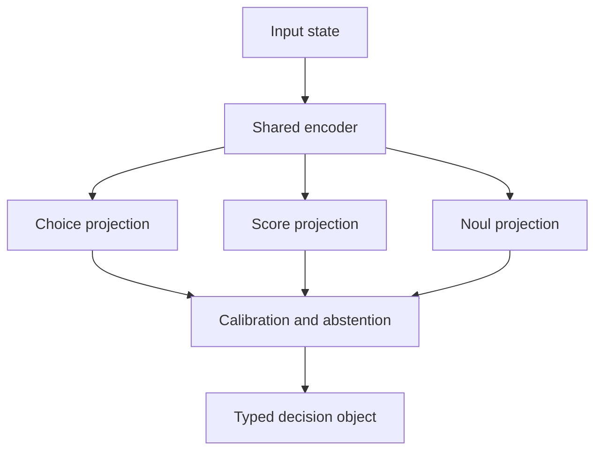

# FastPath AI

**Schema-first, non-generative decision inference for deterministic software paths.**

FastPath AI turns an input state into bounded decisions through one shared encoding pass and
parallel classification or regression heads. It does not generate prose, JSON, or tool calls.
The runtime returns only values permitted by the application contract, plus probabilities,
confidence, variance where applicable, and an abstention signal.

> Status: `v0.1.0-alpha`. This repository proves the runtime and training architecture. It is
> not yet a production safety control or a released 3B model.

## Why it exists

Autoregressive large language models are useful when a task needs synthesis or reasoning.
They are often a poor fit for frequent, bounded decisions such as routing, severity scoring,
policy gates, and tool selection. Those paths benefit from typed outputs, measured calibration,
low CPU latency, and an explicit way to abstain.

FastPath is closer to a schema-compiled multi-task classifier than a smaller chat model.

## Quick start

```bash
python -m pip install -e ".[dev,train]"
python -m examples.ticket_triage.generate_data
python -m examples.ticket_triage.train
python -m fastpath evaluate \
  --model examples/ticket_triage/fastpath-ticket-triage-v0.json \
  --schema examples.ticket_triage.schema:InboundTicketTriage \
  --state "Production DB CPU at 99 percent and connections exhausted"
```

Define the contract in ordinary Pydantic code:

```python
from pydantic import BaseModel
from fastpath import Choice, Score, Noul


class InboundTicketTriage(BaseModel):
    category: Choice["Infrastructure", "Billing", "Security", "General"]
    urgency: Score[1, 5]
    requires_tier3_page: Noul
```

Evaluate locally:

```python
from fastpath import FastPathEngine

engine = FastPathEngine(
    "examples/ticket_triage/fastpath-ticket-triage-v0.json",
    abstain_threshold=0.70,
)
decision = engine.evaluate(
    "Production DB CPU spiked to 99%. Connections exhausted in us-east-1.",
    InboundTicketTriage,
)

if not decision.requires_tier3_page.abstained and decision.requires_tier3_page.prob > 0.90:
    trigger_pager(category=decision.category.value, urgency=decision.urgency.value)
```

## Architecture



The included alpha kernel uses signed feature hashing because it is small, deterministic,
auditable, and runnable without model downloads. The stable boundary is the encoder interface.
A later ONNX transformer encoder can replace it without changing decision contracts or routing
code.

## What is actually guaranteed

- Choice values are members of the declared enumeration.
- Scores are bounded by the declared minimum and maximum.
- Noul outputs contain a boolean decision and a probability in `[0, 1]`.
- A model cannot run against a different contract fingerprint.
- The same artifact, state, and runtime version produce the same decision values.

Calibration, accuracy, latency, fairness, and robustness are measured properties, not type-system
guarantees. They must be validated on data representative of each deployment.

## Evaluation gates

Do not promote a model based on accuracy alone. A release candidate should define and satisfy:

| Gate | Example measure |
|---|---|
| Decision quality | Macro F1, AUROC, MAE by head |
| Calibration | Brier score and expected calibration error |
| Selective risk | Error rate at the chosen coverage after abstention |
| Performance | Warm p50, p95, and p99 on named hardware |
| Stability | Drift by label and input cohort |
| Safety | False-negative ceiling for high-impact classes |

## Repository map

- `src/fastpath`: contracts, compiler, runtime, metrics, trainer, and CLI
- `examples/ticket_triage`: synthetic end-to-end example
- `benchmarks`: reproducible warm latency harness
- `tests`: contract, artifact, runtime, and metric tests
- `docs`: architecture, claims, and seven-day release plan

## Responsible use

Use FastPath as one control inside a broader system. High-impact outcomes need policy checks,
observability, change control, rollback, human escalation, and monitoring for distribution shift.
Never train on enterprise prompt logs unless the organization has rights to the source data and
teacher outputs.

## License

Apache License 2.0. See `LICENSE`.
